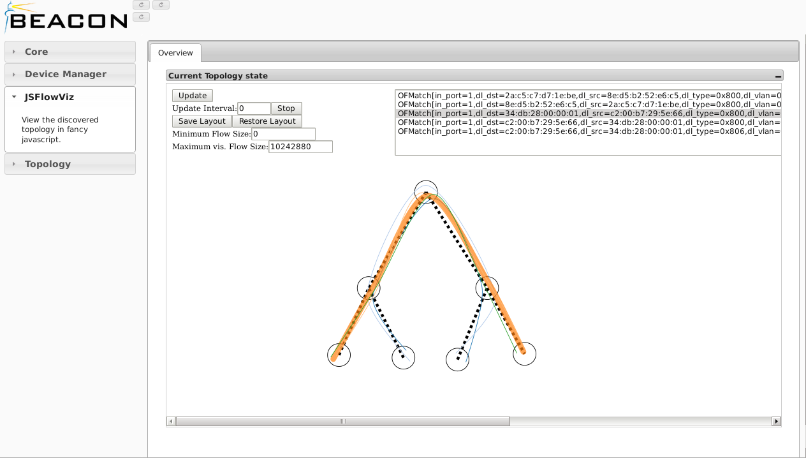

JSFlowViz - A simple OpenFlow Visualization for Beacon
===

Welcome to the JSFlowViz repository.

JSFlowViz is a simple Beacon plugin to visualize OpenFlow networks and dataflows.

### Screenshots

### FAQ

**Q:** Why is my host so slow?  
**A:** JSFlowViz might eat a lot of resources in the browser. Try using a larger update
interval  or manual update.

**Q:** Why does the view show empty circles without connections?  
**A:** This is a known bug. Feel free to fix it or hit the update button to make
it disappear.

**Q:** What is the meaning of "Maximum vis. Flow Size"?  
**A:** JSFlowViz draws flows with strokes from 1 to 5 px according to the number
of transferred bytes. Adapt the "Maximum vis. Flow Size" value to change the rate
at which the stroke of a flow grows.

**Q:** Why is the shown network entangled whenever i open the view?  
**A:** JSFlowViz does not do useful switch placement. You have to disentangle the switches
by hand and then save their positions via the "Save Layout" button. The layout
is stored in  a cookie and can be restored with the "Restore Layout" button.

### Warnings

JSFlowViz is not under active development anymore. The client side js code is
rather inefficent and might contain bugs. Use with caution.
